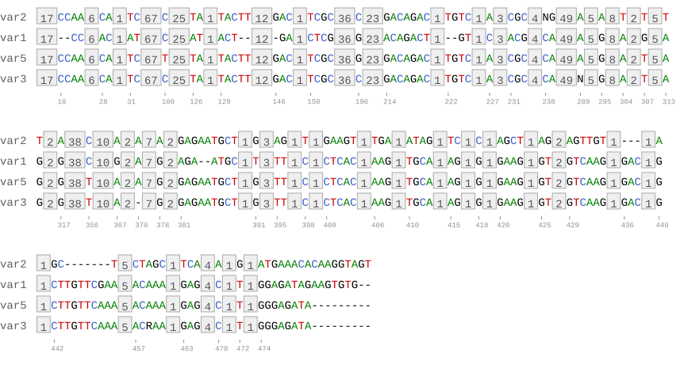
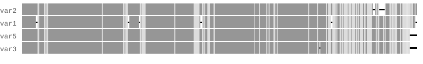
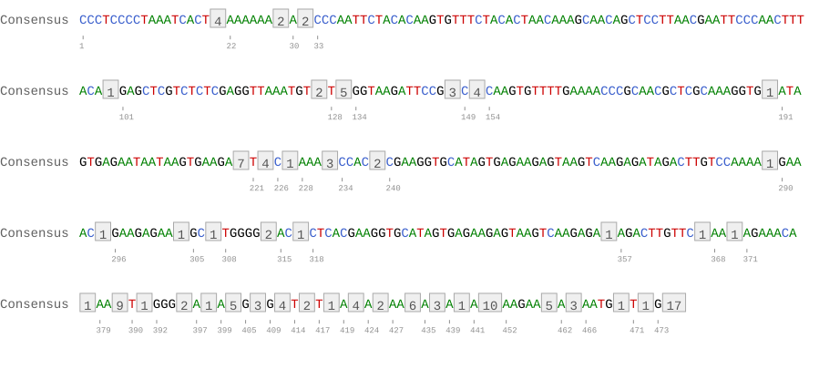
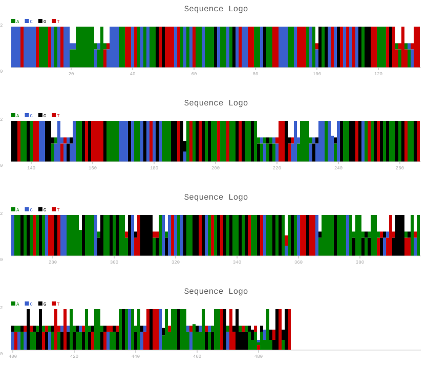

# AlignmentSketch

[](https://github.com/katkah/AlignmentDrawer/actions/workflows/test.yml)

A compact multiple sequence alignment (MSA) visualizer that produces SVG figures directly from a FASTA alignment file.

---

## Requirements

- Python 3.8 or newer
- [Biopython](https://biopython.org/) — for reading FASTA files
- [svgwrite](https://svgwrite.readthedocs.io/) — for generating SVG output

Install both with pip:

```bash
pip install biopython svgwrite
```

---

## Input format

AlignmentSketch expects a **pre-aligned FASTA file** — all sequences must be the same length. Gap characters are represented by `-`.

```
>Mouse
AAACCCGTTTTATGCAAACCCGTTTACGT--TTTGG
>Human
AAACCCGTTTCAGCGAAACCCGTTTGCGTA-TTTGG
>Chimp
AAACCCGTTTCAGCGAAACCCGTTTGCGT--TTTGG
>Rat
AAACCCGTTTATGCGAAACCCGTTTACGTA-TTTGG
```

---

## Usage

```bash
python alignment_sketch.py -i alignment.fasta
```

This produces four SVG files and is equivalent to:

```bash
python alignment_sketch.py \
  --input alignment.fasta \
  --output alignment.svg \
  --entropy-output entropy.svg \
  --consensus-output consensus.svg \
  --logo-output logo.svg
```

Input can also be piped from stdin:

```bash
cat alignment.fasta | python alignment_sketch.py -o alignment.svg
```

---

## Options

| Flag | Short | Default | Description |
|------|-------|---------|-------------|
| `--input` | `-i` | stdin | Input FASTA alignment file |
| `--output` | `-o` | `alignment.svg` | Alignment view output |
| `--entropy-output` | `-e` | `entropy.svg` | Entropy heatmap output |
| `--consensus-output` | `-c` | `consensus.svg` | Consensus view output |
| `--logo-output` | `-l` | `logo.svg` | Sequence logo output |
| `--entropy-txt` | `-t` | *(none)* | Write per-position entropy table to a text file |
| `--width` | `-w` | `800` | Maximum sequence line width in pixels before wrapping |

---

## Output files

### alignment.svg — Alignment view

The main view showing all sequences side by side.

- **Coloured letters** at positions where sequences differ (A = green, C = blue, G = black, T = red)
- **Grey numbered boxes** at positions where all sequences are identical — the number inside is the length of that conserved block
- Coordinate ticks below the last sequence at the start of each variable region
- Long alignments wrap automatically; line width is controlled with `--width`

### entropy.svg — Entropy heatmap

A compact per-sequence, per-position conservation overview.

- Each position is drawn as a coloured rectangle per sequence
- **Dark grey** = conserved (low entropy), **light grey** = variable (high entropy)
- **Thin black bars** mark gap (`-`) positions within a sequence

#### How entropy is calculated

For each alignment column, Shannon entropy is computed as:

```
H = −Σ (freq × log₂ freq)
```

Where `freq` is the frequency of each base (A, C, G, T) among the **non-gap** sequences in that column.

**Step by step:**

1. Count how many sequences have A, C, G, T or a gap (`-`) at this column.
2. Gaps are excluded — `total = number of sequences − number of gaps`.
3. For each base: `freq = count / total`.
4. Apply the formula: multiply each frequency by its log₂, sum them, negate.

**Range:**
- `H = 0.0` — all non-gap sequences have the same base (fully conserved). Drawn as **dark grey**.
- `H = 2.0` — A, C, G, T are equally frequent (maximum disorder). Drawn as **light grey**.

**Why gaps are excluded:**  
A gap means the sequence simply has no base at that position (e.g. due to an insertion in other sequences). Including gaps in the frequency count would artificially inflate entropy at positions that are otherwise perfectly conserved. By excluding them, entropy reflects only the variation among sequences that *do* have a base there.

**Worked example** — 4 sequences at one column:

| Sequences | Base |
|-----------|------|
| Mouse     | A    |
| Human     | A    |
| Chimp     | —    |
| Rat       | A    |

→ gaps = 1, total = 3, freq(A) = 3/3 = 1.0  
→ H = −(1.0 × log₂ 1.0) = **0.0** (conserved despite the gap)

Another column — all four bases present equally:

→ freq(A) = freq(C) = freq(G) = freq(T) = 0.25  
→ H = −4 × (0.25 × log₂ 0.25) = **2.0** (maximum entropy)

### consensus.svg — Consensus view

The opposite of the alignment view — a single-row summary showing only what is shared.

- **Coloured letters** at positions conserved across all sequences
- **Grey numbered boxes** at variable positions, compressed into a single block with the region length
- Coordinate ticks at the start of each conserved block

### logo.svg — Sequence logo

A classic sequence logo showing conservation and base composition per column.

- **Bar height** = information content (IC = 2 − entropy), in bits. A fully conserved column reaches the maximum height (2 bits); a random column produces no bar.
- **Coloured segments** within each bar show base frequency (A = green, C = blue, G = black, T = red). The most frequent base is drawn at the bottom.
- A colour legend (A / C / G / T) and position ticks every 20 bp are included.

### entropy table (--entropy-txt)

A tab-separated text file with one row per alignment column:

```
pos   entropy   IC      A   C   G   T   gaps
1     0.0000    2.0000  4   0   0   0   0
2     0.0000    2.0000  4   0   0   0   0
11    1.5000    0.5000  1   2   0   1   0
...
```

| Column | Description |
|--------|-------------|
| `pos` | 1-based alignment position |
| `entropy` | Shannon entropy (0 = conserved, max ≈ 2 for DNA) |
| `IC` | Information content in bits (2 − entropy) |
| `A C G T` | Raw base counts at that column |
| `gaps` | Number of gap characters (`-`) |

---

## Examples

The figures below are produced from a real Arabidopsis IGS variant alignment (`data/variants_clustalo.fa`, 4 sequences × 490 bp).

**Alignment view** — coloured letters at variable positions, conserved blocks as numbered grey boxes:


**Entropy heatmap** — dark grey = conserved, light grey = variable, thin bar = gap:


**Consensus view** — single row showing only conserved positions:


**Sequence logo** — bar height = information content (bits), segments = base frequencies:


---

**Run commands:**

```bash
# basic run — all four outputs
python alignment_sketch.py -i my_alignment.fasta

# custom output names and wider line width
python alignment_sketch.py \
  -i my_alignment.fasta \
  -o my_alignment.svg \
  -e my_entropy.svg \
  -c my_consensus.svg \
  -l my_logo.svg \
  -w 1200

# logo and entropy table only
python alignment_sketch.py -i my_alignment.fasta -l logo.svg -t entropy.txt
```

---

## Base colours

| Base | Colour |
|------|--------|
| A | Green |
| C | Dark blue |
| G | Black |
| T | Dark red |
=======
# Examples
Graphical representation of alignments of ribosomal DNA intergenic spacers (either by emphasizing the differences in the aligned sequences or by computing sequence entropy)

Havlová, K., Dvořáčková, M., Peiro, R., Abia, D., Mozgová, I., Vansáčová, L., Gutierrez, C., & Fajkus, J. (2016).
Variation of 45S rDNA intergenic spacers in Arabidopsis thaliana. Plant Molecular Biology.


